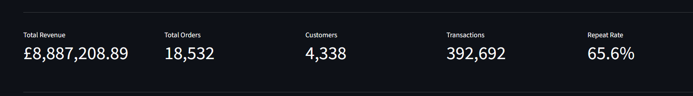
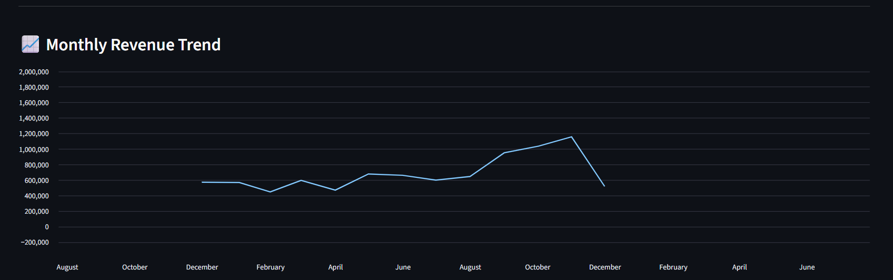
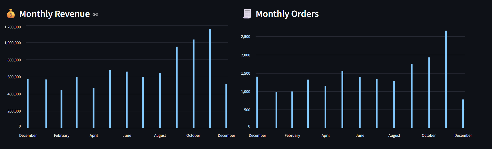
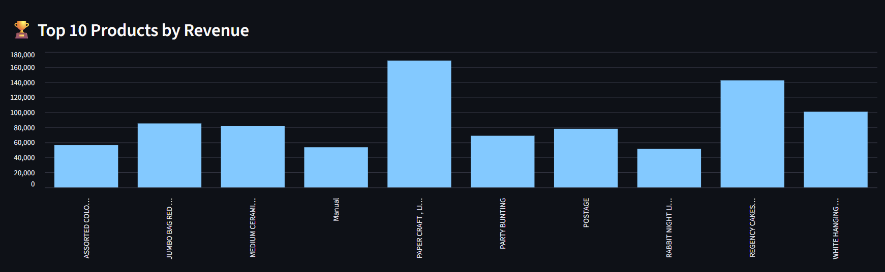
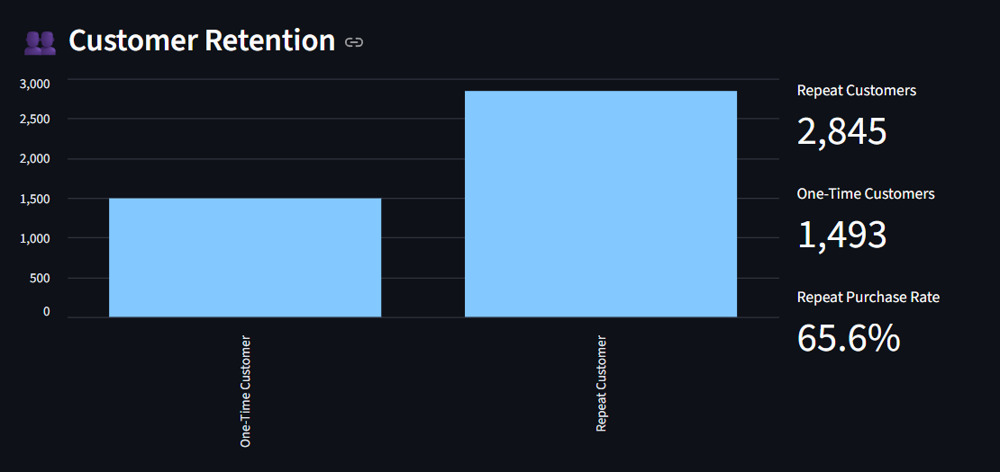
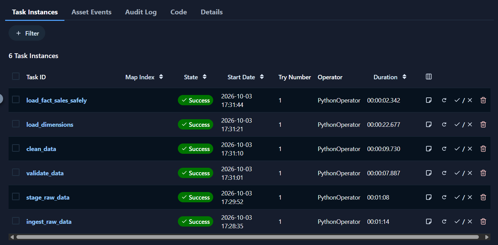
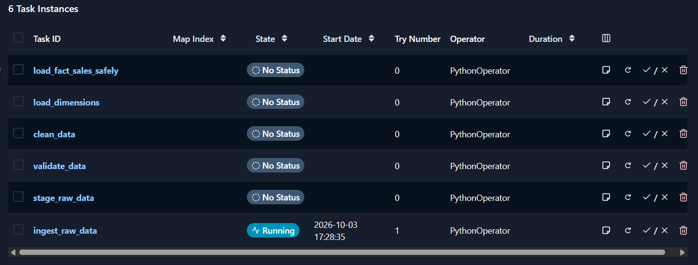

# Retail Analytics Platform

An end-to-end retail analytics and data engineering project built using the UCI Online Retail dataset. The platform processes transactional retail data, validates and cleans records, loads a PostgreSQL data warehouse, orchestrates ETL tasks with Apache Airflow, and presents business insights through a Streamlit dashboard.

## Project Overview

The project demonstrates a retail data engineering workflow, from raw data ingestion to analytics-ready warehouse tables and dashboard visualizations.

### Key Features

- **Data ingestion:** Reads the original Online Retail Excel dataset and records ingestion status.
- **Data staging:** Stores the raw transactional data in a staging layer.
- **Data validation:** Identifies cancelled invoices, invalid quantities, invalid prices, and missing customer identifiers.
- **Data transformation:** Cleans records, converts data types, calculates revenue, and removes duplicates.
- **Data warehousing:** Loads date, customer, product, and geography dimensions, along with the sales fact table, into PostgreSQL.
- **ETL orchestration:** Uses Apache Airflow to coordinate pipeline tasks and track their execution.
- **Business intelligence:** Uses Streamlit to display sales trends, top products, geographical sales, and customer retention metrics.

## Technology Stack

| Component | Technology |
|---|---|
| Programming language | Python |
| Data processing | Pandas |
| Source dataset | UCI Online Retail |
| Data warehouse | PostgreSQL |
| Workflow orchestration | Apache Airflow |
| Containerization | Docker and Docker Compose |
| Dashboard | Streamlit |
| Database connectivity | psycopg2 |
| Configuration management | python-dotenv |
| Machine learning | Scikit-learn, Pandas |
| NLP / model serving | MLflow, FastAPI, Uvicorn |
| Model registry | MLflow Model Registry |
| Model containerization | Docker |
| Prediction monitoring | CSV-based prediction logging |


## Data Processing Results

| Metric | Result |
|---|---:|
| Raw records | 541,909 |
| Rejected records | 144,025 |
| Valid records after validation | 397,884 |
| Duplicate records removed during cleaning | 5,192 |
| Cleaned records | 392,692 |

The pipeline separates invalid records from valid transactions and prepares the cleaned data for analytical processing. The transformation stage calculates revenue and removes duplicate records before loading the data into the warehouse.

## Project Structure

```text
retail-analytics-platform/
├── airflow/
│   ├── dags/
│   │   └── retail_etl_dag.py
│   ├── logs/
│   ├── config/
│   ├── plugins/
│   ├── Dockerfile
│   └── docker-compose.yaml
├── dashboard/
│   └── app.py
├── data/
│   ├── raw/
│   │   ├── Online Retail.xlsx
│   │   └── ingestion_log.json
│   ├── staging/
│   ├── processed/
│   └── rejected/
├── docs/
│   └── screenshots/
├── src/
│   ├── ingestion/
│   │   ├── ingest.py
│   │   └── stage_data.py
│   ├── validation/
│   │   └── validate_data.py
│   ├── transformation/
│   │   └── clean_data.py
│   └── database/
│       ├── load_dimensions.py
│       └── load_fact_sales.py
├── sql/
├── .gitignore
├── .env
├── requirements.txt
└── README.md
```

Note: The `.env` file, generated Airflow configuration, and logs are local environment files and should not be committed to Git.

## Dataset

The project uses the **UCI Online Retail dataset**, which contains transactional records from a UK-based online retail business.

The original dataset includes the following fields:

- `InvoiceNo`: Invoice or transaction identifier.
- `StockCode`: Product identifier.
- `Description`: Product description.
- `Quantity`: Number of items purchased.
- `InvoiceDate`: Date and time of the transaction.
- `UnitPrice`: Price per unit.
- `CustomerID`: Customer identifier.
- `Country`: Customer's country.

The original dataset contains 541,909 records and serves as the input for the data engineering pipeline.

## Data Engineering Workflow

### 1. Data Ingestion

The ingestion module reads the source Excel dataset and records the ingestion status in a JSON log file.

**Script:** `src/ingestion/ingest.py`

### 2. Data Staging

The raw dataset is copied into a staging CSV file, creating an intermediate layer between the source and the validation process.

**Script:** `src/ingestion/stage_data.py`

### 3. Data Validation

The validation module identifies records that do not satisfy the project's data quality rules, including:

- Cancelled invoices.
- Non-positive quantities.
- Non-positive unit prices.
- Missing customer identifiers.

Rejected records are saved separately with a rejection reason, while valid records are passed to the transformation stage.

**Script:** `src/validation/validate_data.py`

### 4. Data Transformation

The transformation module cleans valid transactions, converts fields into appropriate data types, calculates revenue, and removes duplicate records.

Revenue is calculated as:

`Revenue = Quantity × UnitPrice`

The cleaned dataset is saved as a CSV file for warehouse loading.

**Script:** `src/transformation/clean_data.py`

### 5. Data Warehousing

PostgreSQL is used as the data warehouse. The data is organized into dimension tables and a sales fact table to support analytical queries.

**Dimension loading script:** `src/database/load_dimensions.py`

**Fact loading script:** `src/database/load_fact_sales.py`

### 6. ETL Orchestration

Apache Airflow coordinates the pipeline stages through a Directed Acyclic Graph (DAG). Each task represents a stage of the ETL workflow, allowing execution status and task logs to be monitored through the Airflow interface.

**DAG file:** `airflow/dags/retail_etl_dag.py`

## Data Warehouse Design

The PostgreSQL warehouse contains dimension tables, a fact table, and analytical mart tables.

### Dimension Tables

| Table | Purpose |
|---|---|
| `dim_date` | Stores date-related attributes for time-based analysis. |
| `dim_customer` | Stores customer-related attributes. |
| `dim_product` | Stores product identifiers and descriptions. |
| `dim_geography` | Stores geographical information, including country. |

### Fact Table

The `fact_sales` table stores transactional sales information and connects to the dimension tables through keys.

Important fields include:

- `sales_key`
- `invoice_no`
- `date_key`
- `customer_key`
- `product_key`
- `geography_key`
- `quantity`
- `unit_price`
- `revenue`

### Analytical Mart Tables

| Table | Purpose |
|---|---|
| `sales_mart` | Supports sales and revenue analysis. |
| `customer_mart` | Supports customer-level and retention analysis. |

### Warehouse Record Counts

The following counts were observed after the ETL pipeline execution.

| Table | Records |
|---|---:|
| `dim_date` | 305 |
| `dim_customer` | 4,338 |
| `dim_product` | 3,665 |
| `dim_geography` | 37 |
| `fact_sales` | 392,692 |
| `sales_mart` | 392,692 |
| `customer_mart` | 4,338 |

The analytical mart tables were present in the warehouse during validation. The current Airflow DAG runs the ingestion, staging, validation, cleaning, dimension-loading, and fact-table safety-check tasks. It does not independently rebuild the analytical mart tables.

## Airflow ETL Pipeline

The project uses Apache Airflow with Docker Compose to orchestrate the ETL workflow.

### DAG Task Sequence

```text
ingest_raw_data
       |
       v
stage_raw_data
       |
       v
validate_data
       |
       v
clean_data
       |
       v
load_dimensions
       |
       v
load_fact_sales_safely
```

The DAG contains six tasks:

1. `ingest_raw_data` — reads the original dataset and checks the ingestion status.
2. `stage_raw_data` — creates the staging dataset.
3. `validate_data` — identifies rejected records and validates the remaining data.
4. `clean_data` — transforms valid records and produces the cleaned dataset.
5. `load_dimensions` — loads dimension tables into PostgreSQL.
6. `load_fact_sales_safely` — checks the expected and existing fact-table row counts before deciding whether to skip or perform the fact load.

The fact-loading safety check helps prevent a duplicate load when the existing fact-table row count matches the cleaned dataset. It is a basic safeguard and does not verify that every existing record is identical to the cleaned data.

### Running Airflow

Ensure Docker Desktop is installed and running.

From the project root, start the services:

```powershell
docker compose -f airflow/docker-compose.yaml up -d --build
```

Check the service status:

```powershell
docker compose -f airflow/docker-compose.yaml ps
```

Open the Airflow interface in a browser:

`http://localhost:8080`

Log in using the credentials configured for the local environment. In a standard local development setup, the default credentials may be `airflow` / `airflow` unless they have been changed.

Locate the DAG named `retail_analytics_etl`, trigger it, and monitor the status of each task.

To stop the services:

```powershell
docker compose -f airflow/docker-compose.yaml down
```

**Environment note:** The Compose configuration expects Airflow environment settings in `airflow/.env`. Database connection settings must be configured locally. When connecting from Docker containers to PostgreSQL running on the Windows host, `host.docker.internal` can be used as the database host.

## Streamlit Dashboard

The Streamlit dashboard presents business insights derived from the warehouse data and analytical marts.

### Dashboard Metrics

The following values were observed during project validation.

| Metric | Value |
|---|---:|
| Total Revenue | £8,887,208.89 |
| Total Orders | 18,532 |
| Customers | 4,338 |
| Transactions | 392,692 |
| Repeat Customer Rate | 65.6% |

### Dashboard Views

The dashboard includes the following analytical views:

- **Key performance indicators:** Overview of total revenue, orders, customers, transactions, and repeat customer rate.
- **Monthly revenue trends:** Tracks revenue over time to identify sales patterns.
- **Monthly revenue and orders:** Compares sales value and order activity across months.
- **Top 10 products by revenue:** Identifies products contributing the most revenue.
- **Customer retention:** Presents customer-level repeat-purchase and retention information.
- **Geographical sales:** Supports analysis of sales across countries.

### Running the Dashboard

Activate the project's Python virtual environment and install the dependencies before running the application.

From the project root, run:

```powershell
streamlit run dashboard/app.py
```

Streamlit will display a local URL in the terminal. Open that URL in a browser to view the dashboard.

## Screenshots

Screenshots of the dashboard and Airflow execution are stored in `docs/screenshots/`.

### Dashboard KPIs



### Monthly Revenue



### Monthly Revenue and Orders



### Top 10 Products by Revenue



### Customer Retention



### Airflow ETL DAG



### Airflow ETL Execution



## Installation and Local Setup

### Prerequisites

Install the following tools:

- Python 3.11
- PostgreSQL
- Docker Desktop
- Git

### 1. Clone the Repository

```powershell
git clone <YOUR_GITHUB_REPOSITORY_URL>
cd retail-analytics-platform
```

Replace `<YOUR_GITHUB_REPOSITORY_URL>` with the actual URL of your GitHub repository.

### 2. Create a Virtual Environment

```powershell
python -m venv .venv
```

Activate the environment in PowerShell:

```powershell
.\.venv\Scripts\Activate.ps1
```

### 3. Install Dependencies

```powershell
pip install -r requirements.txt
```

### 4. Configure the Database

Create a PostgreSQL database named `retail_dw` if it does not already exist.

Create a root `.env` file in the project directory with the following variables:

```dotenv
DB_HOST=localhost
DB_PORT=5432
DB_NAME=retail_dw
DB_USER=your_postgres_username
DB_PASSWORD=your_postgres_password
```

Replace the example username and password with your local PostgreSQL credentials. Do not commit this file to GitHub.

For the Airflow containers, configure the database connection variables in `airflow/.env`. Use `host.docker.internal` as `DB_HOST` when connecting from Docker containers to PostgreSQL running on the Windows host.

### 5. Prepare the Dataset

Place the original UCI Online Retail Excel dataset at:

```text
data/raw/Online Retail.xlsx
```

Ensure that the file name and location match the paths expected by the project scripts.

### 6. Run the Individual Pipeline Stages

From the project root, run the scripts in sequence:

```powershell
python src/ingestion/ingest.py
python src/ingestion/stage_data.py
python src/validation/validate_data.py
python src/transformation/clean_data.py
python src/database/load_dimensions.py
python src/database/load_fact_sales.py
```

**Important:** The fact-loading script is not fully idempotent. Do not rerun it against a populated `fact_sales` table without first implementing and verifying an appropriate duplicate-prevention or reload strategy. For the orchestrated workflow, use the Airflow DAG's fact-table safety check.

### 7. Start the Dashboard

```powershell
streamlit run dashboard/app.py
```

### 8. Run the Orchestrated Pipeline

With Docker Desktop running and the Airflow environment configured:

```powershell
docker compose -f airflow/docker-compose.yaml up -d --build
```

Open `http://localhost:8080`, locate `retail_analytics_etl`, and trigger the DAG.

## Data Quality and Validation

Data quality checks are applied before records enter the cleaned dataset.

The validation stage checks for:

- Cancelled invoices.
- Invalid or non-positive quantities.
- Invalid or non-positive unit prices.
- Missing customer identifiers.

Rejected records are stored separately with rejection reasons. The transformation stage then prepares valid transactions for analytical use, calculates revenue, and removes duplicate records.

These steps help maintain consistency between the source dataset and the warehouse while retaining information about records excluded from the cleaned dataset.

## Key Business Insights

The dashboard provides an overview of sales performance and customer purchasing activity.

- **Revenue analysis:** Monthly trends help identify changes in sales performance.
- **Product analysis:** Ranking products by revenue highlights the items contributing most to total revenue.
- **Customer analysis:** Customer-level data supports segmentation and repeat-purchase analysis.
- **Retention analysis:** The repeat customer rate provides an overview of returning customer activity.
- **Geographical analysis:** Country-level sales comparisons help examine the distribution of transactions.

The dashboard values are based on the warehouse data available when the project was validated and may change if the dataset or warehouse is reloaded.

## MLOps Extension: Customer Churn Prediction

The project extends its retail analytics pipeline with a machine-learning workflow for identifying customers who may have stopped purchasing. The extension covers model training, evaluation, experiment tracking, model registration, API deployment, containerization, and prediction logging.

### Churn Definition and Features

Churn is defined as a customer having `recency_days > 90`. The model uses four features:

* `order_count`
* `total_quantity`
* `frequency`
* `monetary_value`

`recency_days` is excluded from the input features to avoid directly leaking the target definition into the model.

### Model Training and Evaluation

Logistic Regression and Random Forest were evaluated as candidate classifiers. Logistic Regression achieved the stronger overall results in the recorded experiment.

| Metric    | Logistic Regression |
| --------- | ------------------: |
| Accuracy  |              73.85% |
| Precision |              61.71% |
| Recall    |              57.24% |
| F1-score  |              59.39% |
| ROC-AUC   |              79.33% |

These results provide a baseline for future model comparisons. Evaluation on newly labelled data is needed to determine whether model performance changes over time.

### MLflow Experiment Tracking and Registry

MLflow is used to record model experiments and manage registered model versions. The selected model is registered as `CustomerChurnModel`, allowing the API to load a version from the model registry.

### FastAPI Prediction Service

The FastAPI application in `src/api/app.py` exposes a `/predict` endpoint that accepts customer features and returns a churn prediction and probability.

Example request:

```json
{
  "order_count": 7,
  "total_quantity": 2458,
  "frequency": 7,
  "monetary_value": 4310
}
```

An observed test response classified this example as `0` (not churned), with a predicted churn probability of approximately `0.0558`. This is an example prediction, not a guarantee of future customer behaviour.

### Docker Deployment

The prediction API is packaged as the `customer-churn-api` Docker image and runs in the `customer-churn-container` container. The service exposes port `8000` and connects to the MLflow tracking server to load the registered model.

### Prediction Monitoring

The monitoring module in `src/monitoring/monitor.py` records prediction activity in `data/monitoring/predictions.csv`. The log contains timestamps, input features, predicted labels, and churn probabilities.

The CSV logging workflow was verified with successful API requests. Automated drift detection and retraining are not currently implemented.

### Retraining Strategy

Retraining should be considered when evaluation on newly labelled data shows meaningful performance degradation, when customer behaviour changes substantially, or when the business definition of churn changes. Candidate models should be compared using consistent validation metrics before a new version is registered and deployed.

See [`docs/monitoring_and_retraining.md`](docs/monitoring_and_retraining.md) for the proposed monitoring and retraining strategy.


## Limitations and Future Improvements

Potential improvements to the platform include:

* Implement automated data-drift detection and monitoring dashboards.
* Evaluate model performance against newly labelled customer outcomes.
* Automate model retraining, validation, and conditional registry updates.
* Add API input validation, automated integration tests, and service health monitoring.
* Implement a controlled model deployment and rollback process.


## Learning Outcomes

This project demonstrates practical experience with:

- Building a multi-stage ETL pipeline.
- Working with structured transactional datasets using Pandas.
- Validating and transforming data for analytical use.
- Designing and querying a PostgreSQL data warehouse.
- Organizing data into dimension and fact tables.
- Orchestrating data workflows using Apache Airflow.
- Containerizing pipeline services with Docker Compose.
- Developing interactive analytics dashboards using Streamlit.
- Managing configuration and database credentials using environment variables.
- Documenting pipeline results and data quality checks.

## Author

**Nikita Prabhudesai**